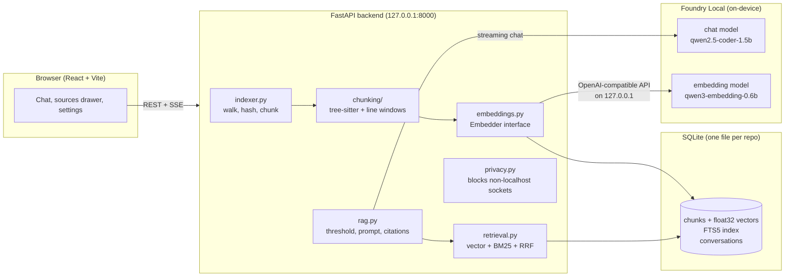

# Lodestar

**A 100% local code-base assistant.** Point Lodestar at a Git repository on your machine, let it index the code, and ask questions like *"How does authentication work in this project?"*. Answers are grounded in the code and cite `file:line` sources.

The language model runs on-device through **Microsoft Foundry Local**. Code, prompts and embeddings never leave the machine: the backend blocks every outbound connection that is not to `localhost`, and the UI loads no fonts, icons or scripts from the internet.

Lodestar is the companion project for the tutorial *Building Your First Local RAG Application with Foundry Local*. The RAG pipeline (chunking, embedding, retrieval, prompting) is written by hand, with no LangChain or LlamaIndex, so each step is easy to read.

---

## How it works



**Indexing.** The indexer walks the repository (respecting `.gitignore`, skipping `node_modules`, build output, binaries, lockfiles and files over 1 MB) and hashes each file with SHA-256. Only new or changed files are processed on a re-index, and chunks of deleted files are removed. Python, JavaScript, TypeScript, Go, Java and C# are parsed with tree-sitter and cut at function, method and class boundaries. Large classes become one chunk per method, each carrying the class signature as context, and tiny neighbours (imports, constants) are merged. Other files use 60-line windows with 10 lines of overlap. Each chunk is embedded with a header such as `# auth/views.py :: LoginView.post`, so the path and symbol count towards the match.

**Retrieval.** A question is embedded and compared with every chunk by cosine similarity (top 20). In parallel, SQLite FTS5 runs a BM25 keyword search (top 20) over identifier-split text, so `getUserName` also matches "get user name". The two rankings are merged with Reciprocal Rank Fusion and the top K (default 6) are kept.

**Answering.** If the best cosine similarity is below the relevance threshold (default 0.35), **the LLM is not called**: Lodestar replies that it found nothing relevant and lists the closest matches. Otherwise the chunks are labelled `[n] path:start-end` and sent with a system prompt that requires answering only from the snippets and citing them as `[1]`. Tokens stream to the browser over Server-Sent Events, and citations are parsed and linked to their sources afterwards. Follow-up questions are first rewritten into a standalone query using the last two turns.

---

## Prerequisites

| Requirement | Notes |
|---|---|
| **Foundry Local** | Windows: `winget install Microsoft.FoundryLocal` · macOS: `brew install microsoft/foundrylocal/foundrylocal`. Lodestar uses the `foundry-local-sdk` Python package, which runs Foundry Local in-process and starts its OpenAI-compatible web service on a random loopback port. |
| Python 3.11+ | Tested with 3.12. |
| Node.js 20+ | For building the frontend. Tested with Node 25. |
| ~3 GB disk | For the chat model (1.8 GB) and the embedding model. |

## Setup

```bash
make setup        # macOS / Linux / Windows with make
.\make.ps1 setup  # Windows PowerShell
```

`setup` creates `backend/.venv`, installs the backend (`pip install -e backend[dev]`) and frontend (`npm ci`) dependencies, then runs `scripts/setup_models.py`. That script is the **only step that uses the internet**. It downloads the tree-sitter grammars, the Foundry Local embedding model and the default chat model. Pass `--fastembed` to also fetch the fastembed fallback models.

## Running

```bash
make dev   # backend with auto-reload on :8000 and Vite on http://127.0.0.1:5173
make run   # build the UI and serve everything from http://127.0.0.1:8000
```

Then open the app, enter a folder path (try `examples/bookshelf`), wait for indexing, and ask a question. In development, Vite proxies `/api` to the backend, so the browser only talks to one local origin.

## Tests, lint and evaluation

```bash
make test   # pytest (fake embedder + fake LLM), then TypeScript + ESLint
make lint   # ruff + ESLint + Prettier
make eval   # hit@K and MRR on examples/bookshelf
```

The tests cover the chunker for every supported language, incremental indexing, RRF fusion, the threshold rule (the LLM must not be called below it), citation parsing, the HTTP API, and privacy. The privacy tests check that a full index-and-chat run attempts no outbound connections, and that the frontend source and build contain no external URLs.

`scripts/eval.py` indexes a repository into a temporary database and reports retrieval quality for vector-only, BM25-only and hybrid search:

```
python scripts/eval.py --embedder fastembed:BAAI/bge-small-en-v1.5 --k 3

| Retrieval  |   hit@3 |    MRR |
|------------|---------|--------|
| vector     |    1.00 |  0.958 |
| bm25       |    1.00 |  0.875 |
| hybrid     |    1.00 |  1.000 |
```

The bundled 12-question set is intentionally small (it is a tutorial demo), so every retriever reaches hit@3 = 1.00 and MRR is the more telling number. For a real project, write a YAML file in the same format as `examples/bookshelf.eval.yaml` and pass `--dataset` and `--repo`.

## Configuration

Copy `.env.example` to `.env`. Every setting is an environment variable with the `LODESTAR_` prefix.

| Variable | Default | Meaning |
|---|---|---|
| `LODESTAR_EMBEDDING_MODEL` | `auto` | `auto` = Foundry Local's `qwen3-embedding-0.6b` if it is downloaded, else fastembed. Also `foundry[:alias]` or `fastembed[:hf-model]`. |
| `LODESTAR_DEFAULT_CHAT_MODEL` | `qwen2.5-coder-1.5b` | Used until a model is picked in Settings. |
| `LODESTAR_EMBEDDING_BATCH_SIZE` | `32` | Chunks per embedding call. |
| `LODESTAR_BLOCK_EXTERNAL_NETWORK` | `true` | Block non-loopback sockets in the backend. |
| `LODESTAR_OFFLINE` | `true` | Stop fastembed from contacting Hugging Face. |
| `LODESTAR_MAX_FILE_BYTES` | `1000000` | Larger files are skipped. |
| `LODESTAR_DATA_DIR` | `backend/data` | SQLite files, `settings.json`, fastembed cache. |
| `LODESTAR_HOST` / `LODESTAR_PORT` | `127.0.0.1` / `8000` | Server address. |

Top-K, relevance threshold, hybrid search and the chat model are changed at runtime on the **Settings** page and saved to `data/settings.json`.

### Choosing an embedding model

All three options run locally. Measured on a laptop CPU with `examples/bookshelf` (33 chunks):

| Embedder | Index time | Vector-only MRR | Notes |
|---|---|---|---|
| `foundry:qwen3-embedding-0.6b` (default) | 36 s (~1.1 s/chunk) | 1.000 | Same runtime as the chat model. Best vector ranking, but slowest. |
| `fastembed:jinaai/jina-embeddings-v2-base-code` | 11 s | 0.889 | Code-aware ONNX model. |
| `fastembed:BAAI/bge-small-en-v1.5` | 3 s | 0.958 | Smallest and fastest. |

The Foundry embedding endpoint does not get faster with larger batches or parallel requests on CPU. For repositories with thousands of chunks, a first index with the default model can take a long time. If that matters more to you than ranking quality, set `LODESTAR_EMBEDDING_MODEL=fastembed` and run `python scripts/setup_models.py --fastembed`. Changing the model triggers a full re-index the next time you index a repository.

## API

| Method | Path | Description |
|---|---|---|
| GET | `/api/health` | Foundry Local, chat model, embedder and privacy status |
| GET | `/api/models` | Chat models in the Foundry Local catalog with download/load status |
| POST | `/api/models/{alias}/load` | Download (if needed) and load a model in the background |
| GET/PUT | `/api/settings` | Runtime settings |
| POST | `/api/repos` | `{ "path": "..." }` register a repository |
| GET | `/api/repos` | Repositories with stats |
| DELETE | `/api/repos/{id}` | Remove a repository and its index (your files are not touched) |
| POST | `/api/repos/{id}/index` | Start (incremental) indexing |
| GET | `/api/repos/{id}/index/stream` | SSE: `progress` … then `done` or `error` |
| GET | `/api/repos/{id}/conversations` | Conversations (plus `PATCH`/`DELETE` on `/conversations/{cid}` and `GET …/{cid}/messages`) |
| POST | `/api/repos/{id}/chat` | SSE: `retrieval`, `token`…, `done` — or `retrieval`, `no_answer` |
| GET | `/api/chunks/{chunk_id}` | A chunk and its surrounding lines, for the source drawer |

## Project layout

```
backend/app/
  main.py           FastAPI app, startup warm-up, serves frontend/dist
  config.py         env config + runtime settings
  db.py             SQLite schema and helpers
  foundry.py        Foundry Local SDK: start service, list/download/load models, LLM client
  embeddings.py     Embedder interface: Foundry Local and fastembed implementations
  chunking/         tree-sitter chunker + sliding-window fallback
  indexer.py        walk -> hash -> chunk -> embed -> store (incremental)
  retrieval.py      vector search, BM25 (FTS5), Reciprocal Rank Fusion
  prompts.py        system prompt, one-shot citation example, query rewrite
  rag.py            retrieve -> threshold -> generate -> cite
  privacy.py        audit hook that blocks non-localhost connections
  routes/           system, repos, chat
backend/tests/      pytest suite with fake embedder and fake LLM
frontend/src/       React + TypeScript + Tailwind + shadcn/ui-style components
  lib/strings.ts    every UI string, ready for translation
scripts/            setup_models.py, eval.py
examples/           bookshelf sample repo + eval questions
```

## Privacy

- The backend installs a Python **audit hook** on `socket.connect`. Connections to loopback addresses are allowed; anything else is recorded and refused. The "Local only" badge and the Settings page show the counter.
- Foundry Local's web service is bound to `127.0.0.1`. SDK telemetry is turned off (`disable_nonessential_telemetry=True`).
- fastembed runs with `HF_HUB_OFFLINE=1`. tree-sitter grammars are downloaded by `make setup`. If one is missing at runtime, the download is blocked and that file falls back to line-window chunking.
- Fonts (Inter, JetBrains Mono) are bundled with `@fontsource`. Shiki languages and themes are bundled. Answers render no remote images or links.
- **What the guard cannot see.** Foundry Local's native runtime runs outside Python's socket layer. When you ask it to, it downloads models from its catalog (at `make setup`, or when you click *Download* in Settings), and it may fetch the catalog listing. It never receives your code or questions: those only travel to its web service on `127.0.0.1`.

## Troubleshooting

| Problem | Fix |
|---|---|
| "Foundry Local could not be started" | Install Foundry Local (see Prerequisites) and restart the backend. `/api/health` shows the exact error. |
| "Model '…' is not downloaded yet" | Open Settings and click **Download**, or run `python scripts/setup_models.py --chat-model <alias>`. |
| "The folder … does not exist" | Use an absolute path to a folder on this machine. Surrounding quotes are fine. |
| Indexing is slow | See *Choosing an embedding model*. The default Foundry embedder takes about a second per chunk on CPU. |
| Answers do not cite sources | Small models sometimes skip citations. Lodestar then lists every retrieved chunk as *Retrieved context*. A larger model (such as `qwen2.5-coder-7b`) may cite more reliably. |
| "Nothing relevant found" for a valid question | Lower the relevance threshold in Settings. Similarity scales differ between embedding models. |
| `npm ci` hangs or fails with a TLS reset | Your network may block `registry.npmjs.org`. Use a mirror for the install only: `npm ci --registry=https://registry.npmmirror.com`. |
| Python crashes (access violation) while chunking | tree-sitter 0.26 is incompatible with tree-sitter-language-pack 1.20 grammars. `pyproject.toml` pins `tree-sitter<0.26`. Reinstall with `pip install -e backend`. |
| Windows symlink warning from Hugging Face | Harmless. Enable Developer Mode to silence it. |
