<div align="center">

<!-- LOGO: save your logo as docs/logo.svg (or .png), then remove the comment markers below.

-->

# Lodestar

**Ask questions about your code base. Get answers with `file:line` citations. Nothing leaves your machine.**


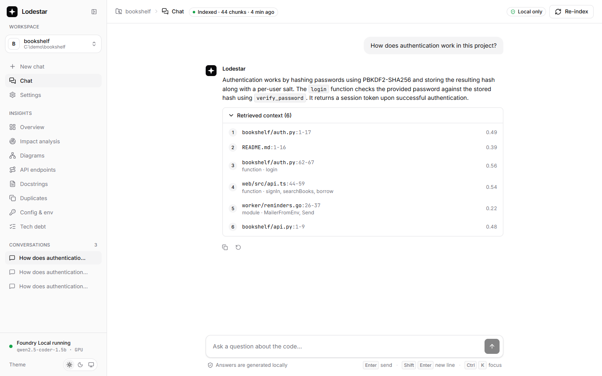

</div>

Lodestar is a **100% local** code-base assistant. Point it at a Git repository on your machine, let it index the code, and ask questions like *"How does authentication work in this project?"*. Answers are grounded in the code and cite their sources.

The language model runs on-device through **Microsoft Foundry Local** by default. Want a bigger model? Point Lodestar at any OpenAI-compatible server you run yourself (Ollama, LM Studio, llama.cpp, vLLM): see [Using a larger model](#using-a-larger-model). Code, prompts and embeddings never leave the machine: the backend blocks every outbound connection that is not to `localhost`, and the UI loads no fonts, icons or scripts from the internet.

Lodestar is the companion project for the tutorial *Building Your First Local RAG Application with Foundry Local*. The RAG pipeline (chunking, embedding, retrieval, prompting) is written by hand, with no LangChain or LlamaIndex, so each step is easy to read.

## Features

- **Code-aware indexing:** tree-sitter splits Python, JavaScript, TypeScript, Go, Java and C# at function, method and class boundaries. Re-indexing is incremental (SHA-256 per file).
- **Hybrid retrieval:** semantic vectors and BM25 keyword search (SQLite FTS5), merged with Reciprocal Rank Fusion.
- **Grounded answers:** inline `[n]` citations link to the exact lines. Below a relevance threshold, Lodestar says it found nothing instead of guessing, and the model is never called.
- **Streaming chat:** Server-Sent Events, multi-turn conversations with follow-up rewriting, persisted per repository.
- **Private by design:** Foundry Local on `127.0.0.1`, a socket-level guard that blocks non-local connections, and fonts, icons and syntax highlighting bundled with the app.
- **Insights:** static analysis of the whole repository: impact analysis, architecture diagrams, an API endpoint catalog, environment variables, tech debt, duplicate code and docstring suggestions. See [Insights](#insights).
- **Clean SaaS UI:** React, Tailwind and shadcn/ui-style components, Lucide icons, and a monochrome light, dark and system theme.

## Quick start

```bash
make setup   # or .\make.ps1 setup on Windows — installs deps and downloads models
make run     # open http://127.0.0.1:8000 and add examples/bookshelf
```

You need [Foundry Local](#prerequisites), Python 3.11+ and Node.js 20+. See [Setup](#setup) for details.

## Screenshots

**Chat with cited sources**

| Answer with sources (light) | Source preview (dark) |
|---|---|
|  | 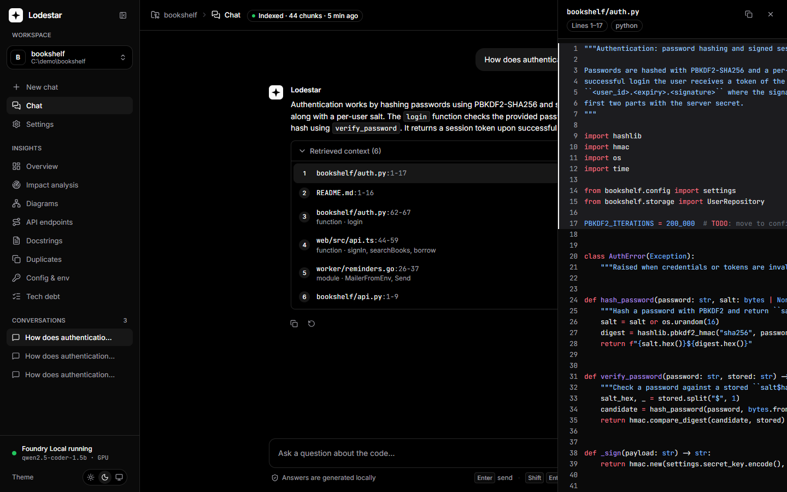 |

**Insights**

| Impact analysis (light) | Impact analysis (dark) |
|---|---|
| 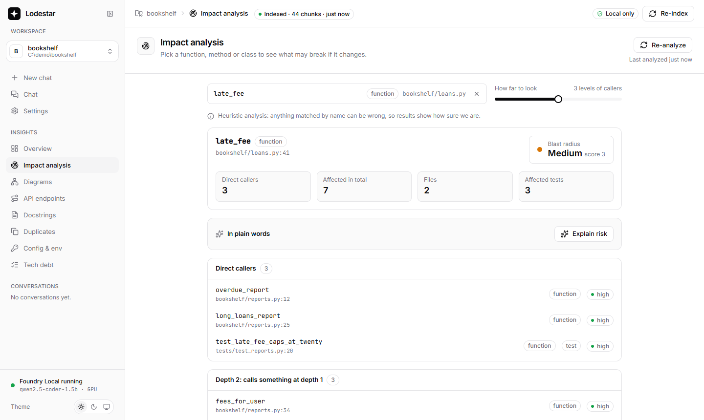 | 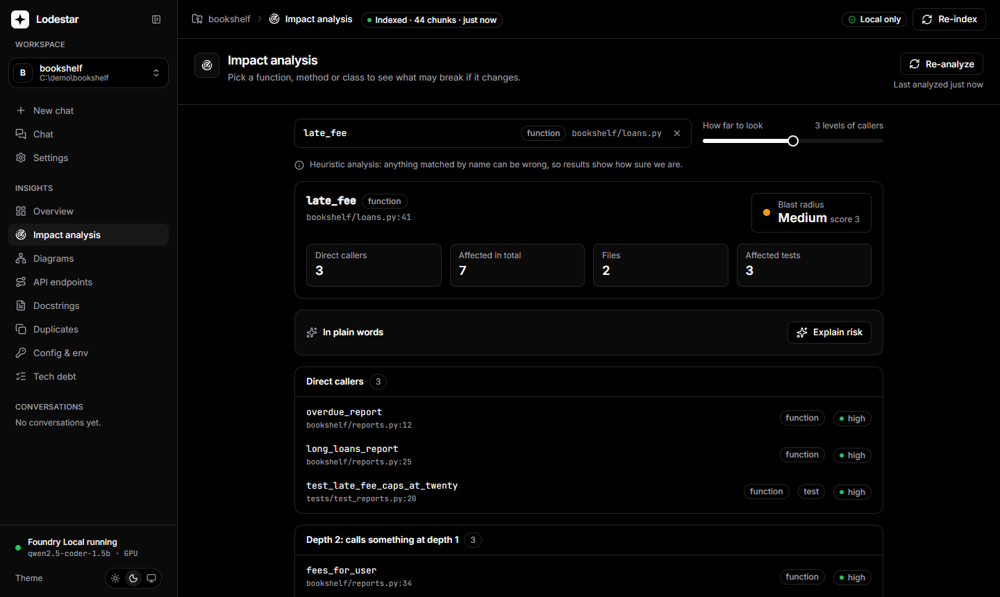 |
| **Architecture diagrams (light)** | **Architecture diagrams (dark)** |
| 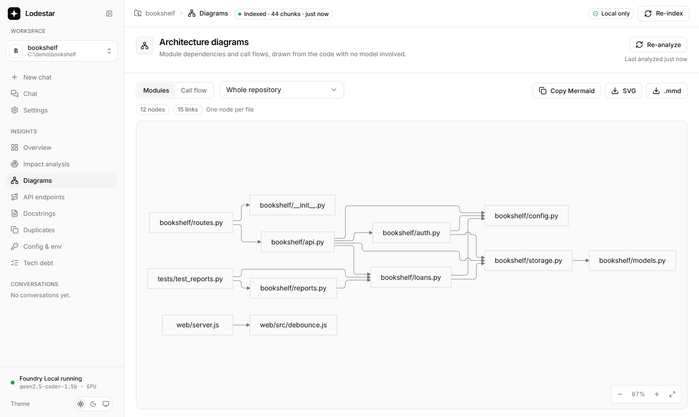 | 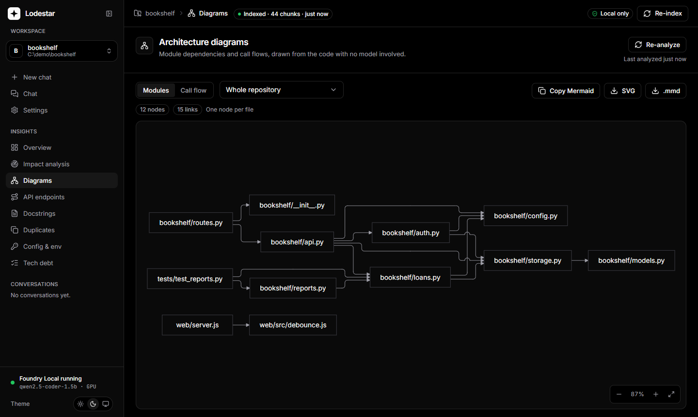 |
| **API endpoints (light)** | **API endpoints (dark)** |
| 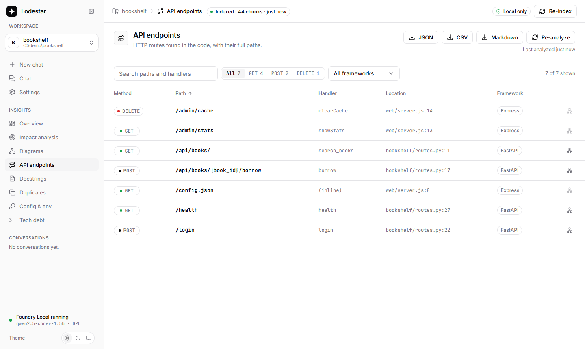 | 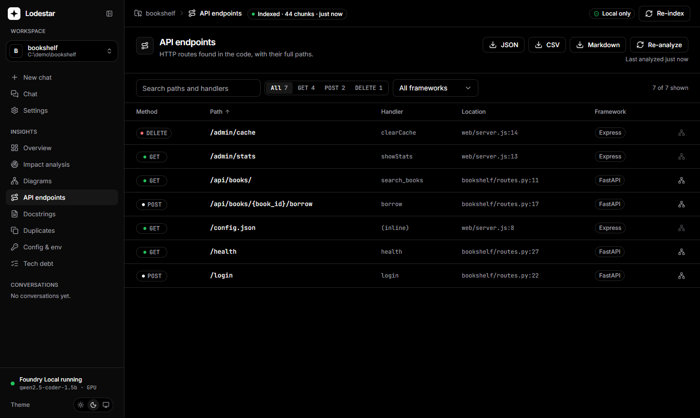 |
| **Duplicate code (light)** | **Duplicate code (dark)** |
| 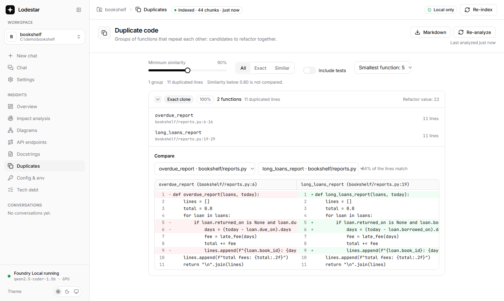 | 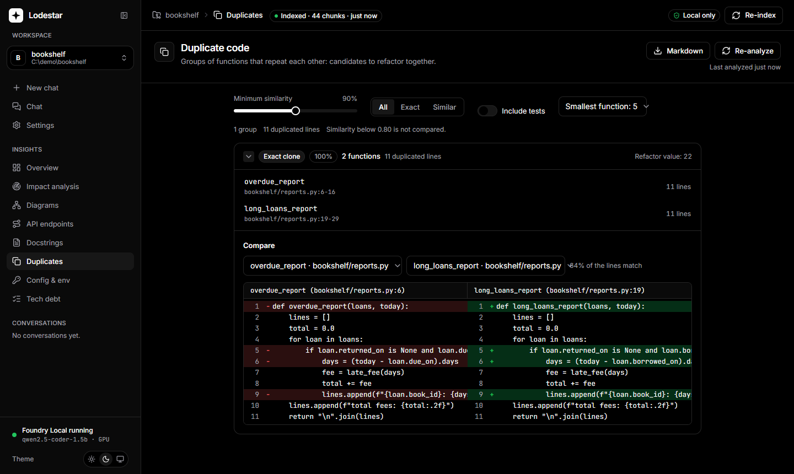 |
| **Docstring suggestions (light)** | **Docstring suggestions (dark)** |
| 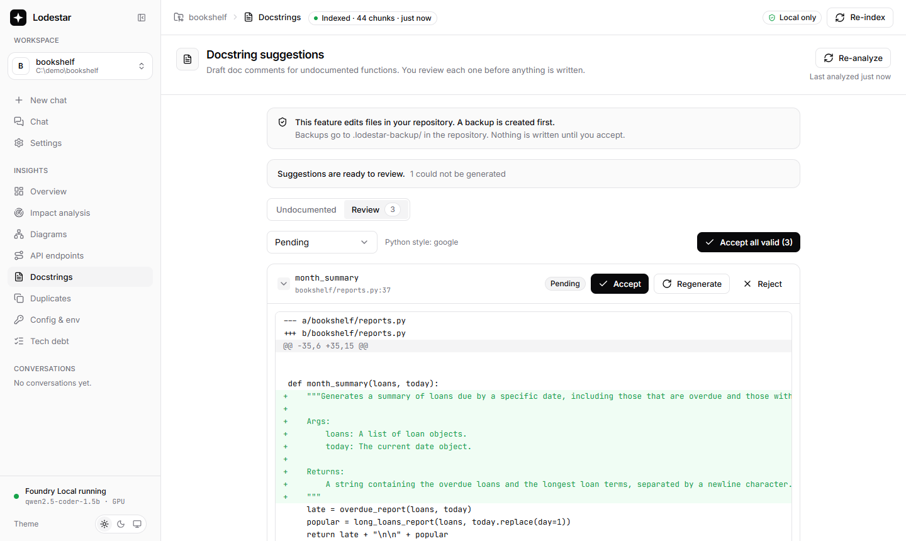 | 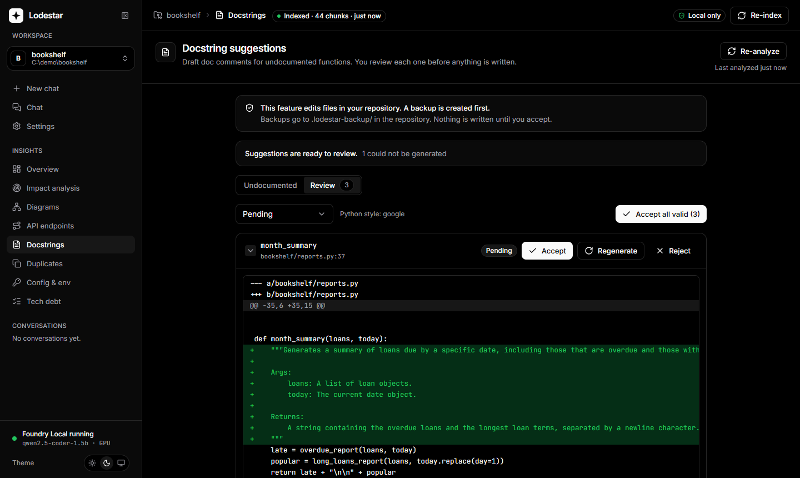 |
| **Tech debt (light)** | **Config and environment (dark)** |
| 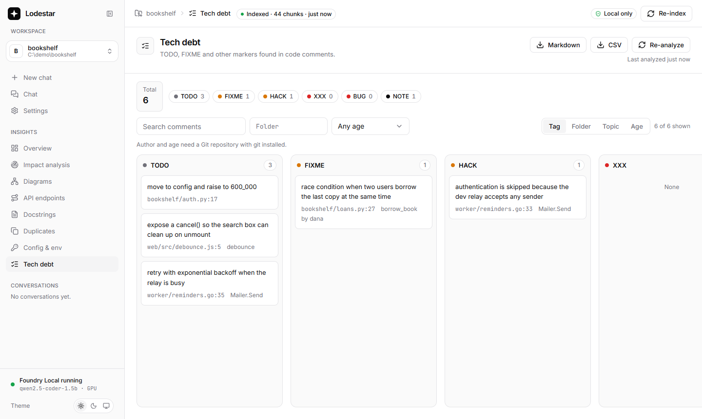 | 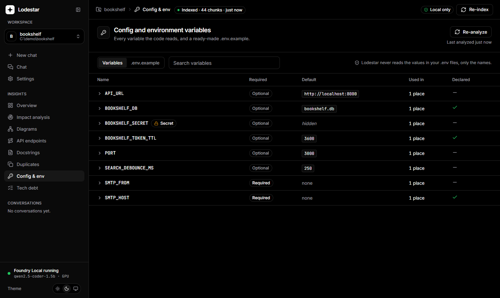 |

**Settings**

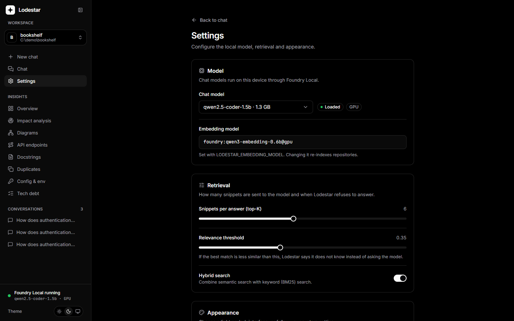

## How it works

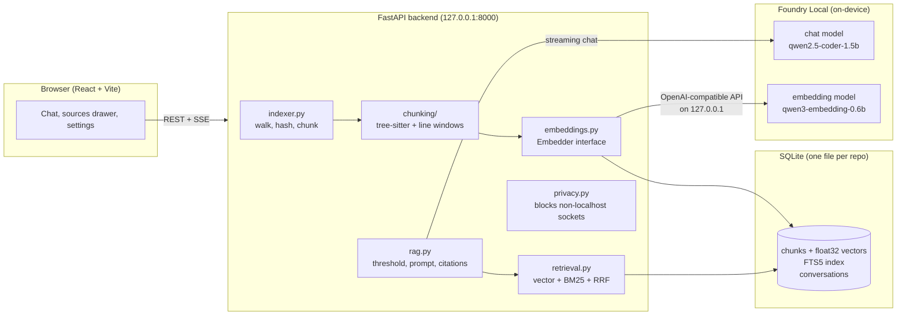

**Indexing.** The indexer walks the repository (respecting `.gitignore`, skipping `node_modules`, build output, binaries, lockfiles and files over 1 MB) and hashes each file with SHA-256. Only new or changed files are processed on a re-index, and chunks of deleted files are removed. Python, JavaScript, TypeScript, Go, Java and C# are parsed with tree-sitter and cut at function, method and class boundaries. Large classes become one chunk per method, each carrying the class signature as context, and tiny neighbours (imports, constants) are merged. Other files use 60-line windows with 10 lines of overlap. Each chunk is embedded with a header such as `# auth/views.py :: LoginView.post`, so the path and symbol count towards the match.

**Retrieval.** A question is embedded and compared with every chunk by cosine similarity (top 20). In parallel, SQLite FTS5 runs a BM25 keyword search (top 20) over identifier-split text, so `getUserName` also matches "get user name". The two rankings are merged with Reciprocal Rank Fusion and the top K (default 6) are kept.

**Answering.** If the best cosine similarity is below the relevance threshold (default 0.35), **the LLM is not called**: Lodestar replies that it found nothing relevant and lists the closest matches. Otherwise the chunks are labelled `[n] path:start-end` and sent with a system prompt that requires answering only from the snippets and citing them as `[1]`. Tokens stream to the browser over Server-Sent Events, and citations are parsed and linked to their sources afterwards. Follow-up questions are first rewritten into a standalone query using the last two turns.

---

## Prerequisites

| Requirement | Notes |
|---|---|
| **Foundry Local** | Windows: `winget install Microsoft.FoundryLocal` · macOS: `brew install microsoft/foundrylocal/foundrylocal`. Lodestar uses the `foundry-local-sdk` Python package, which runs Foundry Local in-process and starts its OpenAI-compatible web service on a random loopback port. |
| Python 3.11+ | Tested with 3.12. |
| Node.js 20+ | For building the frontend. Tested with Node 25. |
| ~3 GB disk | For the chat model (1.8 GB) and the embedding model. |

## Setup

```bash
make setup        # macOS / Linux / Windows with make
.\make.ps1 setup  # Windows PowerShell
```

`setup` creates `backend/.venv`, installs the backend (`pip install -e backend[dev]`) and frontend (`npm ci`) dependencies, then runs `scripts/setup_models.py`. That script is the **only step that uses the internet**. It downloads the tree-sitter grammars, the Foundry Local embedding model and the default chat model. Pass `--fastembed` to also fetch the fastembed fallback models.

## Running

```bash
make dev   # backend with auto-reload on :8000 and Vite on http://127.0.0.1:5173
make run   # build the UI and serve everything from http://127.0.0.1:8000
```

Then open the app, enter a folder path (try `examples/bookshelf`), wait for indexing, and ask a question. In development, Vite proxies `/api` to the backend, so the browser only talks to one local origin.

## Tests, lint and evaluation

```bash
make test   # pytest (fake embedder + fake LLM), then TypeScript + ESLint
make lint   # ruff + ESLint + Prettier
make eval   # hit@K and MRR on examples/bookshelf
```

The tests cover the chunker for every supported language, incremental indexing, RRF fusion, the threshold rule (the LLM must not be called below it), citation parsing, the HTTP API, and privacy. The privacy tests check that a full index-and-chat run attempts no outbound connections, and that the frontend source and build contain no external URLs.

`scripts/eval.py` indexes a repository into a temporary database and reports retrieval quality for vector-only, BM25-only and hybrid search:

```
python scripts/eval.py --embedder fastembed:BAAI/bge-small-en-v1.5 --k 3

| Retrieval  |   hit@3 |    MRR |
|------------|---------|--------|
| vector     |    1.00 |  0.958 |
| bm25       |    1.00 |  0.875 |
| hybrid     |    1.00 |  1.000 |
```

The bundled 12-question set is intentionally small (it is a tutorial demo), so every retriever reaches hit@3 = 1.00 and MRR is the more telling number. For a real project, write a YAML file in the same format as `examples/bookshelf.eval.yaml` and pass `--dataset` and `--repo`.

## Insights

Beyond chat, Lodestar analyses the code it indexes. The **Insights** section of the sidebar has one page per feature. Everything runs locally, and everything except the docstring suggester is read-only.

| Page | What it does |
|---|---|
| **Overview** | Counters for symbols, endpoints, environment variables, undocumented functions, duplicates and tech debt. |
| **Impact** | Pick a function and see who calls it (directly and through other functions), which tests reach it, and a Low / Medium / High blast radius with a short summary. |
| **Diagrams** | Mermaid diagrams of the module graph, the call graph around a symbol, and class hierarchies. Generated locally, never sent to a diagram service. |
| **API Endpoints** | Routes found in Flask, FastAPI, Express, Fastify, NestJS, Koa, Spring, ASP.NET, Gin, Echo, chi and net/http, with prefixes resolved across files. Exports to Markdown. |
| **Config** | Every environment variable the code reads, where, its default, and whether it looks like a secret. Generates a `.env.example`. |
| **Docstrings** | Draft doc comments for undocumented functions, reviewed one by one before anything is written. |
| **Duplicates** | Groups of functions that repeat each other, ranked by how much there is to gain, with a side-by-side comparison. |
| **Tech debt** | `TODO`, `FIXME`, `HACK` and similar comments with git blame ages, grouped by tag, folder, age or topic. |

Open a repository and press **Analyze** (or **Re-analyze**) on any Insights page. The first index run also analyses. Repositories indexed before Insights existed keep working: their database is migrated on first use, and **Re-analyze** fills in the new data without re-embedding anything. Analysis is incremental, keyed by each file's hash, so only changed files are redone.

### How accurate is it?

These pages are **heuristic**. Lodestar resolves names by static analysis without running or type-checking your code, so it can be wrong in both directions:

- Calls through dynamic dispatch, reflection, decorators or dependency injection may be missed, and a common method name may be linked to the wrong definition.
- Every result that depends on name resolution carries a **confidence** (high, medium or low), shown in the UI. A path is only as confident as its weakest link.
- Endpoint detection covers the usual patterns of each framework. Routes assembled at runtime appear as partial paths and are marked as such.
- Duplicates compare structure and embedding similarity. A high score means "worth a look", not "safe to merge".
- The small local model only writes short summaries and labels. Every page works without it and falls back to plain text when its answer is unusable.

Treat the output as a map, not as proof.

### Docstring suggestions and your files

The docstring suggester is the only feature that writes to your repository, so it is deliberately careful:

1. **Dry run first.** Generating only stores proposals. Nothing is written until you press Accept.
2. **The file must be unchanged.** It is hashed again on accept, and refused if it differs from what was analysed.
3. **Only comments are inserted.** The position is computed with tree-sitter, and existing code is never modified.
4. **Verified before writing.** The result is parsed again. If it has a syntax error, or anything outside the inserted text differs by a single byte, nothing is written.
5. **Backup first.** The original goes to `.lodestar-backup/<timestamp>/<path>` in your repository (add it to `.gitignore` if you do not want to commit it). Lodestar never indexes that folder.
6. **Formatting is kept.** Line endings and indentation of the surrounding code are reused.
7. **Re-indexed afterwards.** Only the changed files are indexed again.

The model answers in a fixed `SUMMARY / PARAM / RETURNS` format, which Lodestar validates (no code fences, parameters must exist in the signature, length limits) and renders into the right syntax per language: Google, NumPy or reST docstrings for Python, JSDoc for JavaScript and TypeScript, Javadoc, Go comments and C# XML docs. A bad answer is retried once and then reported as failed instead of being guessed.

Environment files are treated with the same care: Lodestar reads variable **names** from `.env` files but never their values, and never indexes them.

## Configuration

Copy `.env.example` to `.env`. Every setting is an environment variable with the `LODESTAR_` prefix.

| Variable | Default | Meaning |
|---|---|---|
| `LODESTAR_EMBEDDING_MODEL` | `auto` | `auto` = Foundry Local's `qwen3-embedding-0.6b` if it is downloaded, else fastembed. Also `foundry[:alias]` or `fastembed[:hf-model]`. |
| `LODESTAR_DEFAULT_CHAT_MODEL` | `qwen2.5-coder-1.5b` | Used until a model is picked in Settings. |
| `LODESTAR_EMBEDDING_BATCH_SIZE` | `32` | Chunks per embedding call. |
| `LODESTAR_BLOCK_EXTERNAL_NETWORK` | `true` | Block non-loopback sockets in the backend. |
| `LODESTAR_DEVICE` | `auto` | `auto` uses the GPU when its execution provider is installed, `gpu` insists on it, `cpu` never uses it. |
| `LODESTAR_DEBT_TAGS` | `TODO,FIXME,HACK,XXX,BUG,NOTE` | Comment tags collected by the tech debt board. |
| `LODESTAR_DEBT_TOPIC_THRESHOLD` | `0.6` | How similar two debt comments must be to share a topic. |
| `LODESTAR_DUPLICATE_MIN_SIMILARITY` | `0.90` | Default similarity for the duplicate finder (the page slider goes down to 0.80). |
| `LODESTAR_DUPLICATE_MIN_LINES` | `5` | Smallest function the duplicate finder considers. |
| `LODESTAR_DOCSTRING_STYLE` | `google` | Python docstring style: `google`, `numpy` or `rest`. |
| `LODESTAR_OFFLINE` | `true` | Stop fastembed from contacting Hugging Face. |
| `LODESTAR_MAX_FILE_BYTES` | `1000000` | Larger files are skipped. |
| `LODESTAR_DATA_DIR` | `backend/data` | SQLite files, `settings.json`, fastembed cache. |
| `LODESTAR_HOST` / `LODESTAR_PORT` | `127.0.0.1` / `8000` | Server address. |

Top-K, relevance threshold, hybrid search and the chat model are changed at runtime on the **Settings** page and saved to `data/settings.json`.

### GPU acceleration

`make setup` also installs Foundry Local's small **WebGPU** execution provider (about 28 MB) and downloads the GPU builds of the models. WebGPU runs on any DirectX 12, Vulkan or Metal GPU (NVIDIA, AMD, Intel), so no CUDA install is needed. Lodestar picks the GPU build automatically, falls back to the CPU build if it cannot be loaded (for example, not enough video memory), and shows the device in the sidebar and in Settings. Use `python scripts/setup_models.py --no-gpu` or `LODESTAR_DEVICE=cpu` to stay on the CPU.

Measured on an RTX 4050 Laptop GPU (6 GB) with a 13th-gen Core i5:

| | CPU | GPU (WebGPU) |
|---|---|---|
| Chat, qwen2.5-coder-1.5b | 6 tokens/s | 86 tokens/s |
| Embedding, qwen3-embedding-0.6b | 2.1 s/chunk | 0.25 s/chunk |
| Indexing `examples/bookshelf` | 36 s | 6 s |
| A warm question and answer | 20–60 s | about 2.4 s |

The CPU and GPU builds of the embedding model give slightly different vectors (cosine similarity about 0.97), so the device is part of the embedder's name. Switching device re-indexes your repositories the next time you index them.

### Using a larger model

The chat model is replaceable. If you have a stronger model on your computer (or on a server your company runs), point Lodestar at it. Any server that speaks the OpenAI chat API works: **Ollama**, **LM Studio**, **llama.cpp** (`llama-server`), **vLLM**, or a company gateway. Only the chat model changes. Embeddings and the index always stay on this machine.

Set these in `.env` and restart:

```bash
# Ollama (default address)
LODESTAR_LLM_PROVIDER=openai
LODESTAR_LLM_BASE_URL=http://127.0.0.1:11434/v1
LODESTAR_LLM_MODEL=llama3.3:70b

# LM Studio: http://127.0.0.1:1234/v1     llama.cpp: http://127.0.0.1:8080/v1     vLLM: http://127.0.0.1:8000/v1
```

| Variable | Meaning |
|---|---|
| `LODESTAR_LLM_PROVIDER` | `foundry` (default) or `openai` (any OpenAI-compatible endpoint). |
| `LODESTAR_LLM_BASE_URL` | The endpoint, ending in `/v1`. |
| `LODESTAR_LLM_MODEL` | The model name the server expects. |
| `LODESTAR_LLM_API_KEY` | Only if the server needs one. Local servers usually do not. |
| `LODESTAR_LLM_TIMEOUT` | Seconds to wait for a reply (default `120`). |
| `LODESTAR_ALLOWED_HOSTS` | Extra hosts the network guard may reach, comma separated (IPs, CIDR ranges or names). The host in `LODESTAR_LLM_BASE_URL` is allowed automatically. |

What this means for privacy:

- **A server on the same computer** (`127.0.0.1` or `localhost`) keeps everything local. The "Local only" badge stays green.
- **A server elsewhere** (a company machine, a hosted API) receives the question and the code snippets retrieved for it, and the Insights summaries and docstring prompts. The badge then says the model is remote, and the network guard opens only that one host. Everything else stays blocked.
- The Settings page shows where the model runs and has a connection check. A bigger model also gives noticeably better docstring suggestions and impact summaries than the default 1.5B model.

### Choosing an embedding model

All three options run locally. Measured on a laptop CPU with `examples/bookshelf` (33 chunks):

| Embedder | Index time | Vector-only MRR | Notes |
|---|---|---|---|
| `foundry:qwen3-embedding-0.6b` (default, CPU) | 36 s (~1.1 s/chunk) | 1.000 | Same runtime as the chat model. Best vector ranking, but slowest. About 6x faster on a GPU (see above). |
| `fastembed:jinaai/jina-embeddings-v2-base-code` | 11 s | 0.889 | Code-aware ONNX model. |
| `fastembed:BAAI/bge-small-en-v1.5` | 3 s | 0.958 | Smallest and fastest. |

The Foundry embedding endpoint does not get faster with larger batches or parallel requests on CPU. For repositories with thousands of chunks, a first index with the default model can take a long time. If that matters more to you than ranking quality, set `LODESTAR_EMBEDDING_MODEL=fastembed` and run `python scripts/setup_models.py --fastembed`. Changing the model triggers a full re-index the next time you index a repository.

## API

| Method | Path | Description |
|---|---|---|
| GET | `/api/health` | Foundry Local, chat model, embedder and privacy status |
| GET | `/api/models` | Chat models in the Foundry Local catalog with download/load status |
| POST | `/api/models/{alias}/load` | Download (if needed) and load a model in the background |
| GET/PUT | `/api/settings` | Runtime settings |
| POST | `/api/repos` | `{ "path": "..." }` register a repository |
| GET | `/api/repos` | Repositories with stats |
| DELETE | `/api/repos/{id}` | Remove a repository and its index (your files are not touched) |
| POST | `/api/repos/{id}/index` | Start (incremental) indexing |
| GET | `/api/repos/{id}/index/stream` | SSE: `progress` … then `done` or `error` |
| GET | `/api/repos/{id}/conversations` | Conversations (plus `PATCH`/`DELETE` on `/conversations/{cid}` and `GET …/{cid}/messages`) |
| POST | `/api/repos/{id}/chat` | SSE: `retrieval`, `token`…, `done` — or `retrieval`, `no_answer` |
| GET | `/api/chunks/{chunk_id}` | A chunk and its surrounding lines, for the source drawer |
| POST | `/api/repos/{id}/analyze` | Run (or force) the Insights analysis |
| GET | `/api/repos/{id}/insights/status` | When it was analysed and the overview counters |
| GET | `/api/repos/{id}/env`, `/env/example` | Environment variables and a generated `.env.example` |
| GET | `/api/repos/{id}/debt`, `/debt/export` | Tech debt board and its Markdown/CSV export |
| GET | `/api/repos/{id}/endpoints` | API endpoint catalog (`/endpoints/export` for Markdown) |
| GET | `/api/repos/{id}/impact/{symbol_id}` | Callers, tests and blast radius (`POST …/summary` streams a short summary) |
| GET | `/api/repos/{id}/diagram` | Mermaid source for module, call and class diagrams |
| GET | `/api/repos/{id}/duplicates`, `/duplicates/{gid}/diff` | Duplicate groups and a side-by-side comparison |
| GET | `/api/repos/{id}/docs/missing` | Undocumented functions |
| POST | `/api/repos/{id}/docs/suggest` | Generate docstring suggestions in the background (writes nothing) |
| GET | `/api/repos/{id}/docs/suggestions`, `…/{sid}/diff` | The review queue and the unified diff of one suggestion |
| POST | `/api/repos/{id}/docs/suggestions/{sid}/accept`, `/docs/accept` | Write accepted docstrings (backup first) |

## Project layout

```
backend/app/
  main.py           FastAPI app, startup warm-up, serves frontend/dist
  config.py         env config + runtime settings
  db.py             SQLite schema and helpers
  foundry.py        Foundry Local SDK: start service, list/download/load models, LLM client
  embeddings.py     Embedder interface: Foundry Local and fastembed implementations
  chunking/         tree-sitter chunker + sliding-window fallback
  indexer.py        walk -> hash -> chunk -> embed -> store (incremental)
  retrieval.py      vector search, BM25 (FTS5), Reciprocal Rank Fusion
  prompts.py        system prompt, one-shot citation example, query rewrite
  rag.py            retrieve -> threshold -> generate -> cite
  privacy.py        audit hook that blocks non-localhost connections
  analysis/         Insights: symbols, call graph, env, debt, endpoints, duplicates, docstrings
  routes/           system, repos, chat, insights, debt, endpoints, impact, diagrams, duplicates, docs
backend/tests/      pytest suite with fake embedder and fake LLM
frontend/src/       React + TypeScript + Tailwind + shadcn/ui-style components
  lib/strings.ts    every UI string, ready for translation
scripts/            setup_models.py, eval.py
examples/           bookshelf sample repo + eval questions
```

## Privacy

- The backend installs a Python **audit hook** on `socket.connect`. Connections to loopback addresses are allowed; anything else is recorded and refused. The "Local only" badge and the Settings page show the counter.
- Foundry Local's web service is bound to `127.0.0.1`. SDK telemetry is turned off (`disable_nonessential_telemetry=True`).
- fastembed runs with `HF_HUB_OFFLINE=1`. tree-sitter grammars are downloaded by `make setup`. If one is missing at runtime, the download is blocked and that file falls back to line-window chunking.
- Fonts (Inter, JetBrains Mono) are bundled with `@fontsource`. Shiki languages and themes are bundled. Answers render no remote images or links.
- **Bring-your-own model is opt-in.** With `LODESTAR_LLM_PROVIDER=openai`, the guard allows only the host of the configured endpoint (plus `LODESTAR_ALLOWED_HOSTS`). A loopback address changes nothing. A remote address is shown in the UI and the "Local only" badge turns off.
- **What the guard cannot see.** Foundry Local's native runtime runs outside Python's socket layer. When you ask it to, it downloads models from its catalog (at `make setup`, or when you click *Download* in Settings), and it may fetch the catalog listing. It never receives your code or questions: those only travel to its web service on `127.0.0.1`.

## Troubleshooting

| Problem | Fix |
|---|---|
| "Foundry Local could not be started" | Install Foundry Local (see Prerequisites) and restart the backend. `/api/health` shows the exact error. |
| "Model '…' is not downloaded yet" | Open Settings and click **Download**, or run `python scripts/setup_models.py --chat-model <alias>`. |
| "The folder … does not exist" | Use an absolute path to a folder on this machine. Surrounding quotes are fine. |
| Indexing is slow | See *Choosing an embedding model*. The default Foundry embedder takes about a second per chunk on CPU. |
| Answers do not cite sources | Small models sometimes skip citations. Lodestar then lists every retrieved chunk as *Retrieved context*. A larger model (such as `qwen2.5-coder-7b`) may cite more reliably. |
| "Nothing relevant found" for a valid question | Lower the relevance threshold in Settings. Similarity scales differ between embedding models. |
| `npm ci` hangs or fails with a TLS reset | Your network may block `registry.npmjs.org`. Use a mirror for the install only: `npm ci --registry=https://registry.npmmirror.com`. |
| Python crashes (access violation) while chunking | tree-sitter 0.26 is incompatible with tree-sitter-language-pack 1.20 grammars. `pyproject.toml` pins `tree-sitter<0.26`. Reinstall with `pip install -e backend`. |
| Windows symlink warning from Hugging Face | Harmless. Enable Developer Mode to silence it. |
| The first answer after a restart takes a minute | Foundry Local loads the chat model into memory on the first question. Later answers are faster. |

## Contributing

Issues and pull requests are welcome. Before opening a PR, please run:

```bash
make lint && make test   # or: .\make.ps1 lint; .\make.ps1 test
```

CI (`.github/workflows/ci.yml`) runs the same checks on every push: ruff and pytest for the backend, and TypeScript, ESLint, Prettier and a production build for the frontend. The tests use a fake embedder and a fake LLM, so they do not need Foundry Local or a GPU.

## License

[MIT](LICENSE)
